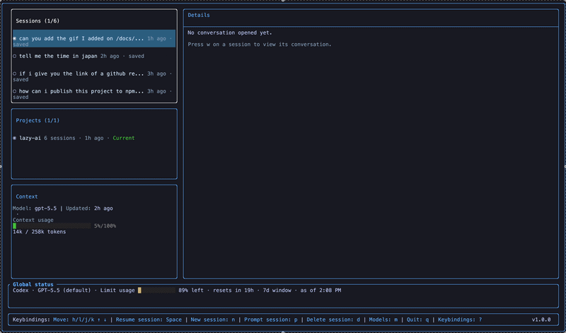

<div align="center">

<h1>
  
</h1>

A keyboard-first terminal UI for Claude Code and Codex sessions
<br/>

[](https://www.npmjs.com/package/@rafaeloviedo/lazyai)
[](https://www.npmjs.com/package/@rafaeloviedo/lazyai)
[](LICENSE)
[](package.json)


</div>

## Elevator Pitch

AI coding agents are great right up until you have five half-remembered conversations scattered across projects, terminals, providers, and model choices. Which session had the plan? Which one was already authenticated? Which one is currently chewing through your prompt? Why is finding the right thread harder than asking the assistant to refactor a service?

LazyAI gives Claude Code and Codex a single terminal home: browse projects, inspect saved sessions, resume work, send prompts, switch models, approve tools, and keep the important context visible without leaving your keyboard.

LazyAI also has a Neovim plugin: [lazy-ai.nvim](https://github.com/RafaelOviedo/lazy-ai.nvim)

## Sponsorship

Support LazyAI by [sponsoring me on GitHub](https://github.com/sponsors/RafaelOviedo).

## Table of Contents

- [Elevator Pitch](#elevator-pitch)
- [Sponsorship](#sponsorship)
- [Features](#features)
  - [Browse Projects and Sessions](#browse-projects-and-sessions)
  - [Resume and Prompt Sessions](#resume-and-prompt-sessions)
  - [Switch Providers and Models](#switch-providers-and-models)
  - [Approve Codex or Claude Code Tools](#approve-codex-or-claude-code-tools)
  - [Inspect Context and Usage](#inspect-context-and-usage)
- [Installation](#installation)
- [Usage](#usage)
  - [Keybindings](#keybindings)
- [Providers and Local Data](#providers-and-local-data)
- [Privacy and Transparency](#privacy-and-transparency)
- [Contributing](#contributing)
- [Donate](#donate)
- [License](#license)

## Features

### Browse Projects and Sessions

LazyAI reads local Claude Code and Codex history, groups sessions by project, and lets you jump through old work with `h`, `j`, `k`, `l`, and `Space`.


### Resume and Prompt Sessions

Press `Space` on a session to resume it, `n` to start a new one in the selected project, or `p` to send a follow-up prompt to the active session. The details panel follows the conversation as new messages arrive.


### Switch Providers and Models

Press `m` to open the provider and model picker. LazyAI detects usable local providers at startup and rebuilds the dashboard when you switch between Claude Code and Codex.

Move between models with `j` / `k`, and choose a **Thinking level** with `h` / `l`. `Enter` applies both choices; `Esc` discards your changes. Available levels depend on the model. **Default** leaves effort to the provider; after an explicit override, it restores the session's original Codex effort or relaunches the same Claude session without an effort override. Changing only the thinking level keeps your active session and applies to the next prompt. Choices last until you exit LazyAI, and the status bar shows the selected level.

Codex levels come from its local model cache. Claude levels use the documented [Claude Code model capabilities](https://code.claude.com/docs/en/model-config#adjust-effort-level); unknown models show “Thinking level unavailable.” Provider settings and organization policies can limit the effort actually used.


### Approve Codex or Claude Code Tools

When Codex or Claude Code asks for tool permission, LazyAI opens an in-terminal approval modal. Choose whether to allow once, allow for the session when available, or deny. `j` / `k` move between the choices, `Enter` confirms, and `Esc` denies.

Session-wide approval is only offered when the provider says the request supports it. LazyAI asks Codex to route escalations to this modal, so approvals appear here rather than following the `approval_policy` in `~/.codex/config.toml`.



### Inspect Context and Usage

The context panel shows session metadata, token information when transcripts provide it, and Codex usage-limit snapshots when saved telemetry is available.


## Installation

Install it globally with npm:

```sh
npm install -g @rafaeloviedo/lazyai
lazyai
```

You need Node.js 20 or newer and at least one configured provider:

- Claude Code, authenticated locally
- Codex, with the `codex` executable available and authenticated locally

LazyAI uses the directory you launch it from as the initial project path.

```sh
cd /path/to/your/project
lazyai
```

## Usage

1. LazyAI detects local providers at startup and prefers one with authentication and saved history.
2. Press `m` to open the provider and model picker. Move with `j` / `k`, then press `Enter`.
3. Move between panels with `h` and `l`.
4. In Projects, highlight a project and press `Space` to load its sessions.
5. In Sessions, press `w` to view a conversation, `Space` to resume it, or `d` to delete a Codex session.
6. Press `n` to start a new session or `p` to prompt the active session.
7. Press `i` to interrupt a running response, `?` for keybindings, or `q` to quit.

Prompting targets the session you started or resumed. Moving the highlight updates metadata without changing the active session, so you can inspect history without accidentally redirecting your next prompt.

### Keybindings

Dashboard shortcuts apply while no modal is open.

| Key | Where | Action |
| --- | --- | --- |
| `h` / `l` | Dashboard | Focus the previous / next panel |
| `j` / `k` | Sessions, Projects | Highlight the next / previous item |
| `Space` | Projects | Select the highlighted project and load its sessions |
| `Space` | Sessions | Resume the highlighted session |
| `w` | Sessions | Open the highlighted conversation; retry a failed load |
| `n` | Dashboard | Open a new-session prompt for the selected project |
| `p` | Dashboard | Open a follow-up prompt for the active session |
| `i` | Dashboard | Interrupt the response being generated |
| `d` | Sessions | Open the delete confirmation for the highlighted Codex session |
| `m` | Dashboard | Open the provider and model picker |
| `j` / `k` | Details | Scroll down / up |
| `PageDown` / `PageUp` | Details | Scroll down / up in larger steps |
| `Home` / `End` | Details | Jump to the top / bottom of the conversation |
| `?` | Dashboard | Open keybinding help |
| `q` | Dashboard | Quit |
| `j` / `k` | Model picker, tool permissions | Move between choices |
| `h` / `l` | Model picker | Change thinking level for the highlighted model |
| `Enter` | Prompts, picker, confirmations | Submit the prompt or confirm the selected action |
| `Ctrl+J` | Prompt input | Insert a new line |
| `Esc` | Modals | Cancel or close; deny a pending tool permission request |

## Providers and Local Data

| Capability | Claude Code | Codex |
| --- | --- | --- |
| Browse projects, sessions, and conversations | Yes | Yes |
| Start, resume, prompt, and interrupt | Yes | Yes |
| Provider and model selection | Yes | Yes |
| Delete sessions | Not supported | Yes, with confirmation |
| Tool permission modal | Yes | Yes, for commands and file edits |
| Token/context information | When present in transcripts | When present in transcripts |
| Usage-limit snapshots | Not available | When present in saved telemetry |

Session history is read from these locations:

| Provider | Default history location | Data-directory override |
| --- | --- | --- |
| Claude Code | `~/.claude/projects/**/*.jsonl` | `CLAUDE_CONFIG_DIR` |
| Codex | `~/.codex/session_index.jsonl` and `~/.codex/sessions/**/*.jsonl` | `CODEX_HOME` |

Browsing history reads local files. Starting or prompting sessions talks to the selected provider through the Claude Agent SDK or Codex app-server and uses that provider's local authentication. Displayed context and usage information comes from saved records and may lag behind the provider's current state.

Model choices come from local provider metadata. A missing model list can mean missing or stale provider data. Authentication detection checks local credential files and API-key environment variables; it does not validate credentials with the provider.

## Privacy and Transparency

LazyAI is a local, open-source terminal client. It has no backend of its own, no accounts, and no telemetry. Everything you see on screen is read from files that Claude Code and Codex already wrote on your machine.

### What LazyAI does not do

- **No LazyAI server.** There is nowhere for LazyAI to send anything, because no such service exists. No analytics, no telemetry, no crash reporting, no usage pings, no update checks.
- **No network code of its own.** LazyAI's source contains no HTTP, socket, or WebSocket calls anywhere — no `fetch`, no `node:http`/`node:https`/`node:net`, no third-party analytics SDK.
- **No tokens stored, copied, or transmitted.** LazyAI never writes a credential anywhere, never displays one, never logs one, and never sends one.
- **No files written.** LazyAI's own code opens your provider data read-only. It creates no state file, cache, config, or log of its own, and it does not modify your transcripts.
- **No install-time scripts.** The package has no `postinstall` or other lifecycle hook.

### What LazyAI reads

All of it is local, and all of it is read-only:

| Provider | Files read | Purpose |
| --- | --- | --- |
| Claude Code | `~/.claude/projects/**/*.jsonl` | Session history and conversations |
| Claude Code | `~/.claude/settings.json`, `~/.claude.json` | Model list and signed-in account label |
| Claude Code | `~/.claude/.credentials.json` | Signed-in check only — see below |
| Codex | `~/.codex/session_index.jsonl`, `~/.codex/sessions/**/*.jsonl` | Session history and conversations |
| Codex | `~/.codex/config.toml`, `~/.codex/models_cache.json` | Model list |
| Codex | `~/.codex/auth.json` | Signed-in check and sign-in mode — see below |

`CLAUDE_CONFIG_DIR` and `CODEX_HOME` relocate these roots, and LazyAI honours both.

### How credentials are handled

To tell a signed-out provider from a signed-in one, LazyAI has to know whether a credential exists. It opens the credential file, checks that a token field is present and non-empty, and keeps **only the resulting yes/no** — `hasCredentials()` in [`src/app/registry/detect-providers.ts`](src/app/registry/detect-providers.ts) returns a `boolean`. The token value is never retained, displayed, logged, or sent anywhere. The same presence-only check applies to the `ANTHROPIC_API_KEY`, `CODEX_API_KEY`, and `OPENAI_API_KEY` environment variables.

Detection is entirely offline: LazyAI never validates a credential against the provider.

Two non-secret labels are read so the status panel can show who you are signed in as: the account email from `~/.claude.json` (`oauthAccount.emailAddress`) and Codex's `auth_mode` from `auth.json`. Both are only ever drawn in your own terminal.

### What does leave your machine

One thing, and only when you ask for it: **the prompts you send.** Starting, resuming, or prompting a session has to reach the model, so LazyAI hands it to the provider you selected:

- **Claude Code** — through Anthropic's official [`@anthropic-ai/claude-agent-sdk`](https://www.npmjs.com/package/@anthropic-ai/claude-agent-sdk), which runs your locally installed `claude` (preferring your own CLI over the copy the SDK bundles).
- **Codex** — by spawning your local `codex app-server` and speaking JSON-RPC to it over stdin/stdout.

In both cases the request goes to Anthropic or OpenAI exactly as it would if you typed the same prompt into the CLI yourself, authenticated by that provider's own local credentials. LazyAI adds no destination of its own, and browsing history sends nothing at all.

Deleting a session is delegated to the provider too, never done behind its back: Codex deletions go out as a `thread/delete` request to `codex app-server`, and Claude Code session deletion is [deliberately unsupported](src/app/registry/provider-registry.ts) rather than implemented by unlinking transcripts directly.

### Verify it yourself

Please don't take the list above on trust — the whole point of it being open source is that you can check. From a clone of this repo:

```sh
# No outbound network calls in LazyAI's own code (expect: no matches)
grep -rnE "fetch\(|node:https?|node:net|node:dgram|node:tls|WebSocket|XMLHttpRequest" src/ index.ts

# No file writes or deletions in LazyAI's own code (expect: no matches)
grep -rnE "writeFile|appendFile|unlink|rmdir|mkdir|createWriteStream" src/ index.ts

# Every filesystem import is a read-only API
grep -rn "node:fs" src/ index.ts
```

The files worth reading in full are short:

- [`src/app/registry/detect-providers.ts`](src/app/registry/detect-providers.ts) — every line of credential handling lives here
- [`src/providers/claude/claude-session-repository.ts`](src/providers/claude/claude-session-repository.ts) and [`src/providers/codex/codex-session-repository.ts`](src/providers/codex/codex-session-repository.ts) — all transcript reading
- [`src/providers/claude/claude-sdk-client.ts`](src/providers/claude/claude-sdk-client.ts) and [`src/providers/codex/codex-app-server-client.ts`](src/providers/codex/codex-app-server-client.ts) — the only code that talks to a provider

LazyAI has just two runtime dependencies: `@anthropic-ai/claude-agent-sdk` (Anthropic's official SDK, and the component that talks to Anthropic on your behalf) and `@b9g/termdom` (the terminal renderer). If you audit the installed tree you will see further packages such as `express`, `hono`, and `cors`. Those arrive through the Agent SDK's dependency on `@modelcontextprotocol/sdk`, which ships transports for MCP servers; nothing LazyAI pulls in or calls uses them to send your data anywhere. `@b9g/termdom` depends only on text layout and parsing libraries (`bidi-js`, `css-tree`, `linebreak`, `parse5`, `nwsapi`, `arabic-persian-reshaper`).

Found something that contradicts any of this? Please [open an issue](https://github.com/RafaelOviedo/lazy-ai/issues) — it would be treated as a bug.

## Contributing

Issues and pull requests are welcome. The source is TypeScript, the terminal UI is built with [`@b9g/termdom`](https://www.npmjs.com/package/@b9g/termdom), and provider integrations live under `src/providers`.

## Donate

LazyAI isn’t my full-time job, but I spend my free time working on it. If you’d like to support the project, please consider [sponsoring me](https://github.com/sponsors/RafaelOviedo).

## License

ISC
