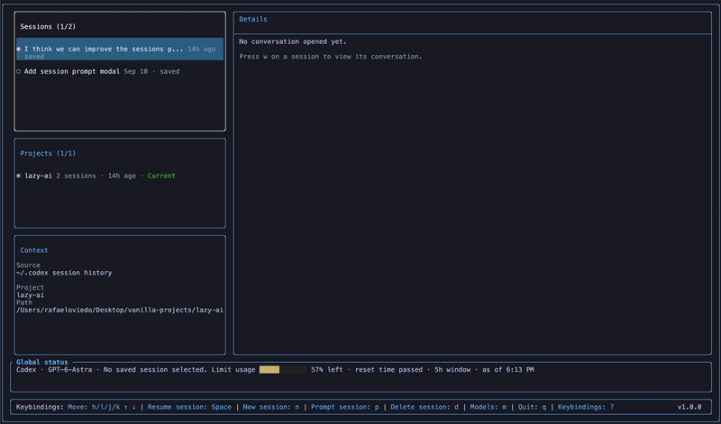
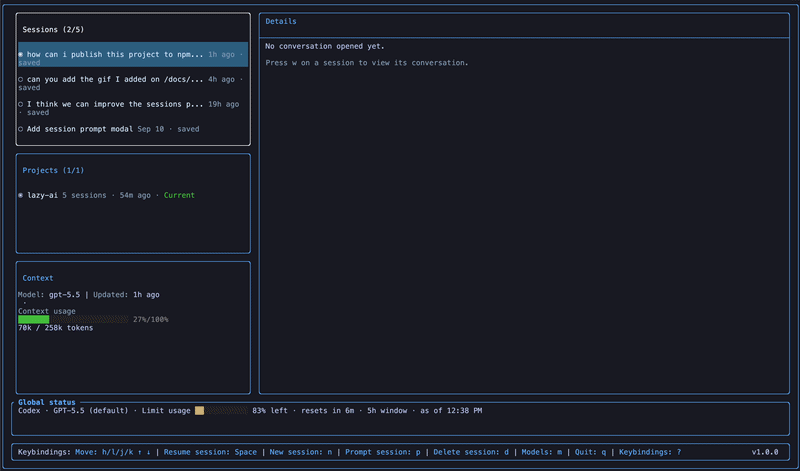
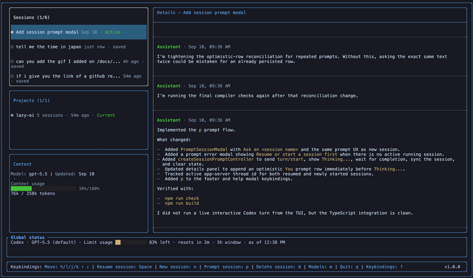
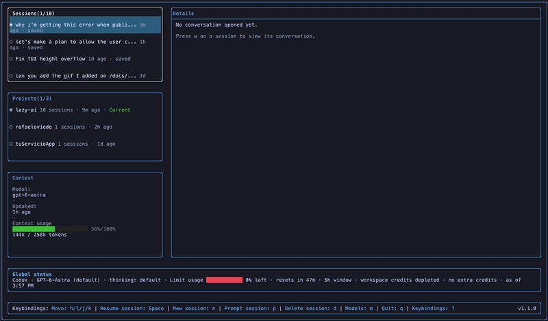
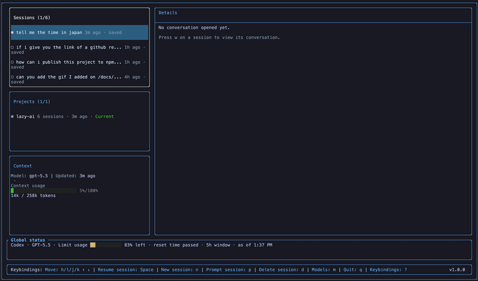

<div align="center">

<h1>
  
</h1>

A keyboard-first terminal UI for Claude Code and Codex sessions
<br/>

[](https://www.npmjs.com/package/@rafaeloviedo/lazyai)
[](https://www.npmjs.com/package/@rafaeloviedo/lazyai)
[](LICENSE)
[](package.json)



</div>

## Elevator Pitch

AI coding agents are great right up until you have five half-remembered conversations scattered across projects, terminals, providers, and model choices. Which session had the plan? Which one was already authenticated? Which one is currently chewing through your prompt? Why is finding the right thread harder than asking the assistant to refactor a service?

LazyAI gives Claude Code and Codex a single terminal home: browse projects, inspect saved sessions, resume work, send prompts, switch models, approve tools, and keep the important context visible without leaving your keyboard.

## Table of Contents

- [Elevator Pitch](#elevator-pitch)
- [Features](#features)
  - [Browse Projects and Sessions](#browse-projects-and-sessions)
  - [Resume and Prompt Sessions](#resume-and-prompt-sessions)
  - [Switch Providers and Models](#switch-providers-and-models)
  - [Approve Claude Code Tools](#approve-claude-code-tools)
  - [Inspect Context and Usage](#inspect-context-and-usage)
- [Installation](#installation)
- [Usage](#usage)
  - [Keybindings](#keybindings)
- [Providers and Local Data](#providers-and-local-data)
- [Adding Demo GIFs](#adding-demo-gifs)
- [Contributing](#contributing)
- [License](#license)

## Features

### Browse Projects and Sessions

LazyAI reads local Claude Code and Codex history, groups sessions by project, and lets you jump through old work with `h`, `j`, `k`, `l`, and `Space`.



### Resume and Prompt Sessions

Press `Space` on a session to resume it, `n` to start a new one in the selected project, or `p` to send a follow-up prompt to the active session. The details panel follows the conversation as new messages arrive.



### Switch Providers and Models

Press `m` to open the provider and model picker. LazyAI detects usable local providers at startup and rebuilds the dashboard when you switch between Claude Code and Codex.



### Approve Codex or Claude Code Tools

When Codex or Claude Code asks for tool permission, LazyAI opens an in-terminal approval modal. Choose whether to allow once, allow for the session when available, or deny.

<!-- TODO: Add tool permission GIF at docs/gifs/approve-claude-code-tools.gif -->

### Inspect Context and Usage

The context panel shows session metadata, token information when transcripts provide it, and Codex usage-limit snapshots when saved telemetry is available.



## Installation

Install it globally with npm:

```sh
npm install -g @rafaeloviedo/lazyai
lazyai
```

You need Node.js 20 or newer and at least one configured provider:

- Claude Code, authenticated locally
- Codex, with the `codex` executable available and authenticated locally

LazyAI uses the directory you launch it from as the initial project path.

```sh
cd /path/to/your/project
lazyai
```

## Usage

1. LazyAI detects local providers at startup and prefers one with authentication and saved history.
2. Press `m` to open the provider and model picker. Move with `j` / `k`, then press `Enter`.
3. Move between panels with `h` and `l`.
4. In Projects, highlight a project and press `Space` to load its sessions.
5. In Sessions, press `w` to view a conversation, `Space` to resume it, or `d` to delete a Codex session.
6. Press `n` to start a new session or `p` to prompt the active session.
7. Press `i` to interrupt a running response, `?` for keybindings, or `q` to quit.

Prompting targets the session you started or resumed. Moving the highlight updates metadata without changing the active session, so you can inspect history without accidentally redirecting your next prompt.

### Keybindings

Dashboard shortcuts apply while no modal is open.

| Key | Where | Action |
| --- | --- | --- |
| `h` / `l` | Dashboard | Focus the previous / next panel |
| `j` / `k` | Sessions, Projects | Highlight the next / previous item |
| `Space` | Projects | Select the highlighted project and load its sessions |
| `Space` | Sessions | Resume the highlighted session |
| `w` | Sessions | Open the highlighted conversation; retry a failed load |
| `n` | Dashboard | Open a new-session prompt for the selected project |
| `p` | Dashboard | Open a follow-up prompt for the active session |
| `i` | Dashboard | Interrupt the response being generated |
| `d` | Sessions | Open the delete confirmation for the highlighted Codex session |
| `m` | Dashboard | Open the provider and model picker |
| `j` / `k` | Details | Scroll down / up |
| `PageDown` / `PageUp` | Details | Scroll down / up in larger steps |
| `Home` / `End` | Details | Jump to the top / bottom of the conversation |
| `?` | Dashboard | Open keybinding help |
| `q` | Dashboard | Quit |
| `j` / `k` | Model picker, tool permissions | Move between choices |
| `Enter` | Prompts, picker, confirmations | Submit the prompt or confirm the selected action |
| `Ctrl+J` | Prompt input | Insert a new line |
| `Esc` | Modals | Cancel or close; deny a pending tool permission request |

## Providers and Local Data

| Capability | Claude Code | Codex |
| --- | --- | --- |
| Browse projects, sessions, and conversations | Yes | Yes |
| Start, resume, prompt, and interrupt | Yes | Yes |
| Provider and model selection | Yes | Yes |
| Delete sessions | Not supported | Yes, with confirmation |
| Tool permission modal | Yes | Not implemented |
| Token/context information | When present in transcripts | When present in transcripts |
| Usage-limit snapshots | Not available | When present in saved telemetry |

Session history is read from these locations:

| Provider | Default history location | Data-directory override |
| --- | --- | --- |
| Claude Code | `~/.claude/projects/**/*.jsonl` | `CLAUDE_CONFIG_DIR` |
| Codex | `~/.codex/session_index.jsonl` and `~/.codex/sessions/**/*.jsonl` | `CODEX_HOME` |

Browsing history reads local files. Starting or prompting sessions talks to the selected provider through the Claude Agent SDK or Codex app-server and uses that provider's local authentication. Displayed context and usage information comes from saved records and may lag behind the provider's current state.

Model choices come from local provider metadata. A missing model list can mean missing or stale provider data. Authentication detection checks local credential files and API-key environment variables; it does not validate credentials with the provider.

## Contributing

Issues and pull requests are welcome. The source is TypeScript, the terminal UI is built with [`@b9g/termdom`](https://www.npmjs.com/package/@b9g/termdom), and provider integrations live under `src/providers`.

## License

ISC
